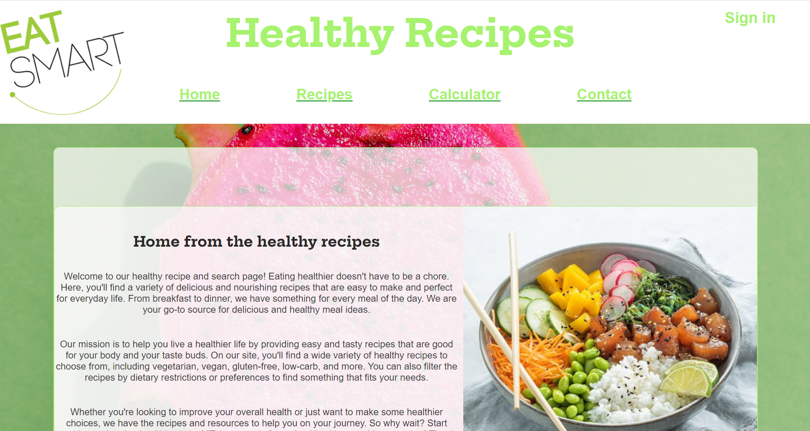

## Index 
## 1 Introduction
## 2 Launch application
## 3 Additional commands
## 4 Documentation 
###

healthy food should be accessible to everyone today everyone can look up the healthiest recipes. however, our site offers a lot more functionality if you register with us. registering is very easy and you are committed to nine.

general functionalities of the application :

1) search recipes.
2) convert number of products from a recipe to kcal.
3) extensive analysis for a diet of 2000 kcal in a day.
4) register.
5) login / log out. 
6) fill in a contact form.

these are the benefits of registering :

1) you can use our filters for kcal, diets and allergies.
2) you can save recipes.
3) and remove recipes again.

## 2 Launch application

# Getting Started with Healthy Recipes App

This project was made with  React. 

## Available Scripts
install the node_modules first by running the following command in the terminal:

### `npm install`

In the project directory, you can run:

### `npm start`

Runs the app in the development mode.\
Open [http://localhost:3000](http://localhost:3000) to view it in your browser.

now you are ready to launch the application.

## 3 Additional commands

> **Note**: Additional commands that are possible to use 
### `npm test`

Launches the test runner in the interactive watch mode.
See the section about [running tests](https://create-react-app.dev/docs/running-tests/) for more information.

### `npm run build`
>**Note**:use this command if you want to create a new .env list for environment variables. and want to save it in your project.
> 
Builds the app for production to the build folder.
It correctly bundles React in production mode and optimizes the build for the best performance.

The build is minified and the filenames include the hashes.
Your app is ready to be deployed!

See the section about [deployment](https://create-react-app.dev/docs/deployment/) for more information.

### `npm run eject`
> **Note**: this is a one-way operation. Once you eject, you can’t go back!

If you aren’t satisfied with the build tool and configuration choices, you can eject at any time. This command will remove the single build dependency from your project.

Instead, it will copy all the configuration files and the transitive dependencies (webpack, Babel, ESLint, etc) right into your project so you have full control over them. All of the commands except eject will still work, but they will point to the copied scripts so you can tweak them. At this point you’re on your own.

You don’t have to ever use eject. The curated feature set is suitable for small and middle deployments, and you shouldn’t feel obligated to use this feature. However we understand that this tool wouldn’t be useful if you couldn’t customize it when you are ready for it.

## 4 Documentation

## Docs

### Fonts
Fonts are from google fonts: https://fonts.google.com/
Fonts used: Roboto Condensed, Hepta Slab.

### Icons

This project uses google fonts icons.
[Link to google fonts icons ](https://fonts.google.com/icons)

### Images 

- Source: pexels.com 
- Link: https://www.pexels.com

### Recipes Search

> **Note**: the available api id and key of this project are in the explanatory document in the afterword (page 30) 

[Link to Edamam-recipe-api](https://developer.edamam.com/edamam-recipe-api)

Recipes are provided by the Edamam Recipe Search API (https://developer.edamam.com/edamam-recipe-api)

Current Edamam Recipe API service which is being used is the free developer package which provides:
- 10,000 API calls/month
- 10 throttling calls/minute

An API call request to the Recipe Search API is made:
1) User types a recipe/food/ingredient name and clicks search button

Recipes are fetched from this URL which requires a query and id + key of the registered package account (https://api.edamam.com/api/recipes/v2?type=public&q=${query}&app_id=${APP_ID}&app_key=${APP_KEY}&${dietsToExclude}&${allergenToExclude}&${totalCalorieRange}`))

Favorite recipes are stored in context and then stored in localStorage which is done inside the favorites context
#
### Calorie Calculator

> **Note**: the available api id and key of this project are in the explanatory document in the afterword (page 30)
> 
> 
[Link to Edamam-nutrition-api](https://developer.edamam.com/edamam-nutrition-api)

Current Edamam Nutrition Analysis API service which is being used is the free developer package which provides:

- 4000 lines/month
- 20 per minute

An API call request to the Recipe Search API is made:

1) user types a recipe and clicks calculate button.

Nutrition are fetched from a post URL which requires a url title, ingr .params, headers  id + key of the registered package account (https://api.edamam.com/api/nutrition-details&app_id=${id}&app_key=${key})

### back-end to log in 

> **Note**: no registered usernames are already taken because the back-end clears everything after an hour.

NOVI Educational Backend
Rest endpoints(https://frontend-educational-backend.herokuapp.com/)

Test GET : /api/test/all

Register : POST /api/auth/signup

log in : POST /api/auth/signin

### contact form 

I used the contact form from FORMSUBMIT.

 [Link to Form submit](https://formsubmit.co)

url https://formsubmit.co/your@email.com